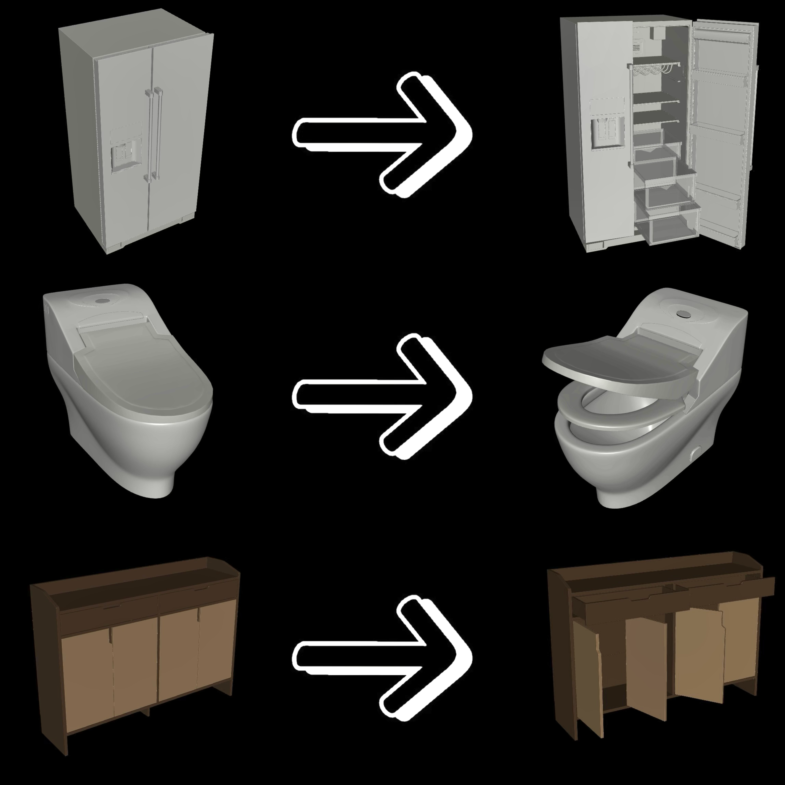
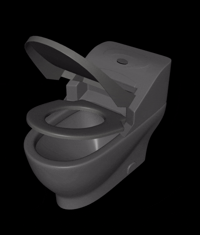

# LinkForge

English | [中文](README.md)

LinkForge is a multimodal LLM-based MJCF constraint generation system that automatically analyzes 3D furniture models, identifies moving parts, and generates motion constraints required for MuJoCo physics simulation.

## 🎬 Demo

<table>
<tr>
<td width="50%">
  
</td>
<td width="50%">
  
</td>
</tr>
</table>

## 🎯 Core Features

- **Scene Rendering & Orchestration**: Automatically renders multi-view images of 3D models
- **Scene Awareness Analysis**: Identifies furniture types and moving parts
- **Constraint Reasoning**: Infers motion constraints based on visual and geometric information
- **MJCF Constraint Generation**: Automatically generates MuJoCo XML format motion constraints

## 🏗️ System Architecture

```
LinkForge
├── agent/                    # Core agent modules
│   ├── render_orchestrator.py      # Rendering orchestrator agent
│   ├── scene_awareness_agent.py   # Scene awareness agent
│   ├── constraint_reasoning_agent.py  # Constraint reasoning agent
│   ├── mjcf_constraint_agent.py   # MJCF constraint generation agent
│   ├── memory.py                  # Memory system
│   ├── tools/                     # Tool modules
│   └── utils/                     # Utility functions
├── DEMO/                    # Demo program
│   └── main.py              # Main entry point
├── docs/                    # Documentation
└── Examples/                # Example models
```

## 🚀 Quick Start

### 1. Install Dependencies

```bash
pip install -r agent/utils/requirements.txt
```

### 2. Environment Configuration

Copy `.env.example` to `.env` and fill in your API keys:

```bash
cp .env.example .env
```

Then edit the `.env` file and fill in your actual API keys and Base URL.

Two configuration methods are supported:
- **Qwen API**: Set `QWEN_API_KEY` and `QWEN_BASE_URL`
- **OpenAI Compatible API**: Set `OPENAI_API_KEY` and `OPENAI_BASE_URL`

For detailed instructions, please refer to the comments in the `.env.example` file.

### 3. Run the Program

```bash
python DEMO/main.py
```

The program will:
1. Load the specified XML model file
2. Render multi-view images
3. Analyze the scene and moving parts
4. Reason about motion constraints
5. Generate MJCF format constraint files

## 📖 Documentation

Detailed system architecture documentation:

- [System Architecture](docs/系统架构.md) - Complete system architecture description, including agent responsibilities, data flow, memory system, data models, etc.

## 🔧 Configuration

You can modify the following configurations in `DEMO/main.py`:

- `xml_path`: Path to the XML model file to process
- `memory_path`: Memory storage path (default: `scene_memory`)
- `max_workers`: Number of parallel processing threads

## 📝 License

This project is licensed under the MIT License. See the [LICENSE](LICENSE) file for details.

## 🙏 Acknowledgments

- LangChain team for the excellent framework
- MuJoCo physics simulation engine
- Qwen and OpenAI for providing multimodal large language models

